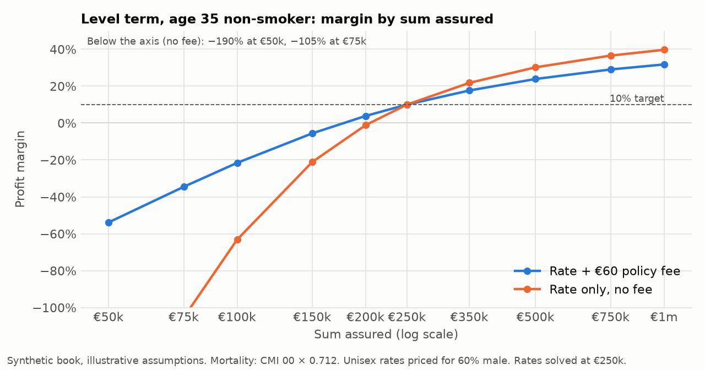
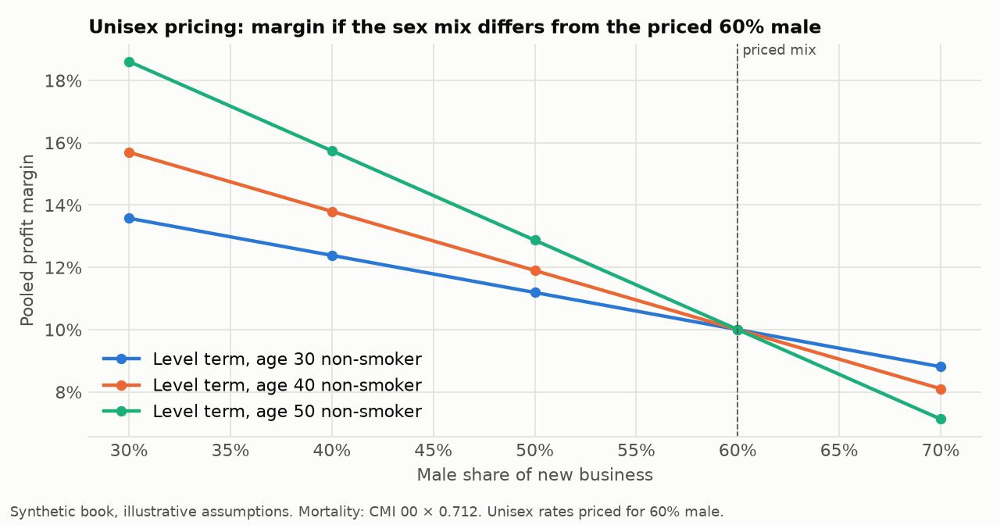
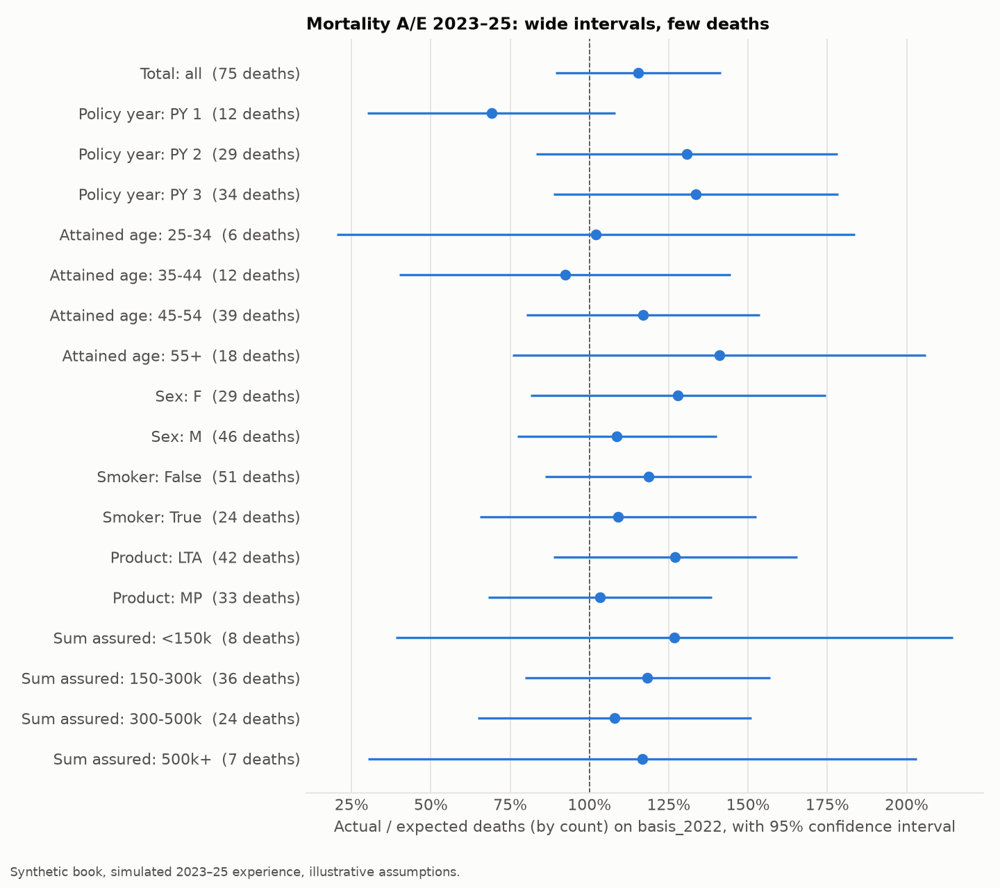
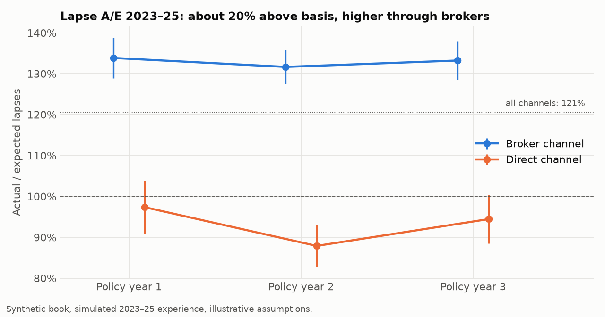
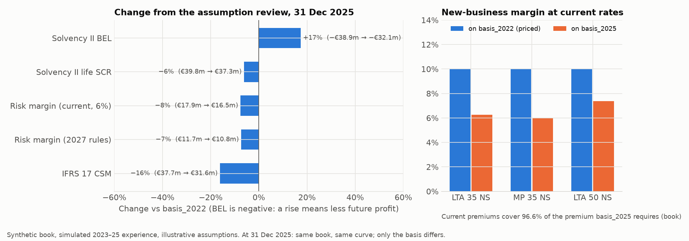
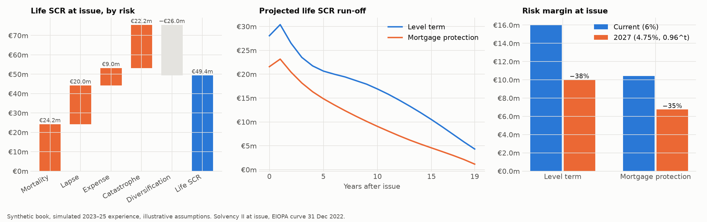
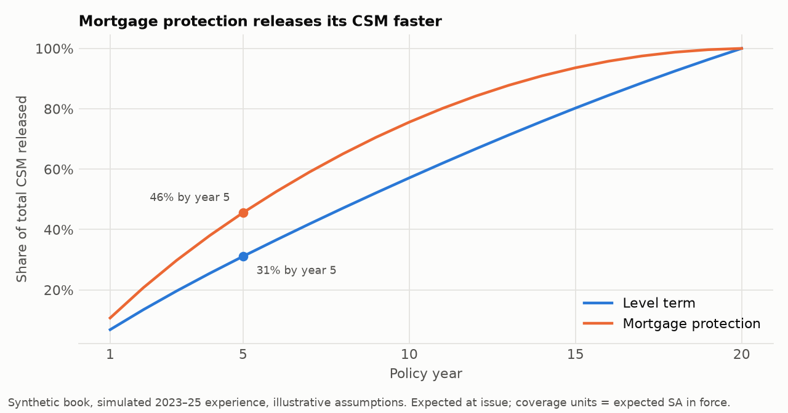
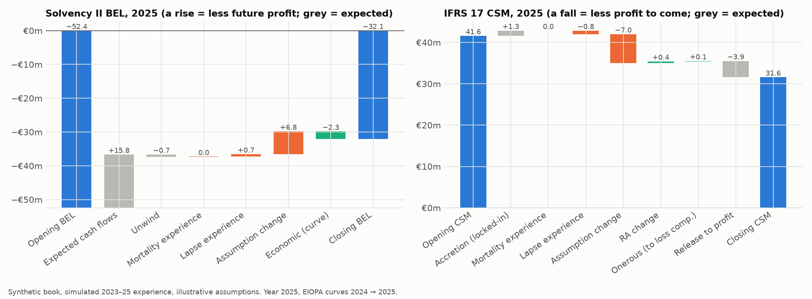

# Life Protection Model

**How should an Irish life insurer price a term-assurance book, monitor emerging mortality and lapse experience, and translate assumption changes into profitability, IFRS 17 earnings and Solvency II capital?**

One seriatim cash-flow engine follows a synthetic book of 50,000 Irish protection policies — level term assurance (LTA) and mortgage protection (MP), all issued on 1 January 2023 — through what a life actuarial team does over three years: price it, value it under Solvency II and IFRS 17, simulate 2023–25 experience, run an experience study, update the assumptions, and explain every year's movement in an analysis of change.

> **Synthetic book, illustrative assumptions.** The CMI 00 mortality tables, CSO Irish life tables and EIOPA risk-free curves are real; the policies, the 2023–25 experience and the lapse, expense and commission assumptions are not. Six market quotes (bonkers.ie, September 2026) are used only as a reasonableness check.

Project page: *(GitHub Pages — see `site/`)* · Technical note: [`report/technical_note.pdf`](report/technical_note.pdf) · Build spec: [`SPEC.md`](SPEC.md)

## Key findings

1. **Unisex pricing creates a sex-mix risk.** EU law (Test-Achats, 2012) forbids sex-based premiums, so rates are priced on a pooled margin assuming 60% male new business (anti-selection plus prudence). At the priced rate a man aged 35 earns about 4% and a woman well above 10%. If the mix reaches 70% male, a 50-year-old non-smoker cell earns 7.1% instead of 10%.
2. **Fixed costs make small policies unprofitable — and onerous.** The €60 policy fee does not cover per-policy costs: a €50k level-term policy has a margin of −54% (−190% without the fee); break-even is around €177k. A fee of about €150 would flatten margins across sizes. Under IFRS 17 the only onerous groups are exactly these small-cover, young cells.
3. **Three years of mortality experience is not credible; lapses are.** 75 deaths against 65 expected (A/E 115%, 95% CI 89%–141%, credibility Z = 0.26), so mortality moves only +4%. 12,624 lapses (A/E 121%, CI ±2%) are fully credible; brokers lapse at 133% of basis against 93% for direct.
4. **The assumption review costs 16% of the CSM and ~3.5% on price.** At 31 December 2025 the new basis raises Solvency II BEL by €6.7m (−€38.9m → −€32.1m) and cuts the CSM by €6.1m (€37.7m → €31.6m). Current premiums cover 96.6% of what the new basis requires; 2026 rates rise 2–8%, more for mortgage protection.
5. **The 2027 risk-margin reform cuts the risk margin by 36%.** €25.6m → €16.3m at issue (level term −38%, mortgage protection −35% because its capital runs off faster), lifting day-one own funds from €23.7m to €33.0m. The new formula is also less sensitive to rates (±100bp moves it −5.5%/+6.0% vs −6.3%/+7.0%).
6. **The same lapse variance lands differently.** In 2023 excess lapses raised the Solvency II BEL by €1.2m at once (own funds hit immediately) but reduced the IFRS 17 CSM by €1.3m, to be felt as lower profit over the remaining cover.

## Charts

| | |
|---|---|
|  |  |
|  |  |
|  |  |
|  |  |

## Model

| Part | What it does | Code |
|---|---|---|
| Cash-flow engine | q, w, in-force ℓ; premiums, commission, expenses, claims; value V_t by backward recursion (forward PV = V₀) | `projection.py` |
| Pricing | unisex rates to a 10% margin at an 8% RDR; zeroised prospective reserves; profit vector and signature, NPV, IRR, payback; fee, sensitivity and sex-mix analysis; market reasonableness check | `pricing.py`, `pricing_analysis.py` |
| Experience | 2023–25 simulated from a hidden truth; A/E by count and amount with 95% CIs; limited-fluctuation credibility; generated `basis_2025.yaml` with reasons | `simulate.py`, `experience.py` |
| Solvency II | BEL on EIOPA curves; mortality, lapse (up/down/mass, direction rules), expense and catastrophe stresses; correlated life SCR run-off; risk margin under current and 2027 rules | `solvency2.py` |
| IFRS 17 (GMM) | two portfolios × profitability groups (para 20 for sex); Monte Carlo RA (10,000 scenarios, 75th percentile, SII-calibrated volatilities); CSM with locked-in accretion and coverage-unit release; loss component | `ifrs17.py` |
| Analysis of change | each year 2023–25: expected, unwind, mortality and lapse experience, assumptions, economics — for BEL, RA and CSM | `aoc.py` |

Assumptions live in [`assumptions/`](assumptions/); `basis_2025.yaml` is generated by the experience study, never edited by hand.

## Validation

- **Golden values** from an independent implementation (SPEC §13.3): premiums, ℓ, V, reserves, profit vectors, NPV, IRR, stress losses, SCR, risk margin, CSM and coverage units for two test policies all match.
- **Excel reconciliation**: [`excel/single_policy_check.xlsx`](excel/single_policy_check.xlsx) rebuilds a single policy in live Excel formulas (golden fixture and real basis); every formula is evaluated in the test suite and agrees with Python within €0.01 (largest difference ~1e-12).
- **Identities**: forward PV = backward V₀; in-force conservation; every BEL, RA and CSM walk reconciles to the closing value; RM ratio equals the Said–Chaayra identity and lies in [0.396, 0.792]; Σ CSM releases = CSM₀ + accretion.
- **Experience study**: with truth = basis, total A/E falls inside its 95% CI in ≥ 17 of 20 seeds; the study code is checked never to read the truth file.
- 60 automated tests (`uv run pytest`).

## Limitations

Synthetic 50,000-policy book; CMI 00 is UK insured-lives experience from 1999–2002, adjusted by a documented improvement judgement (not Irish insurer data); lapse, expense and commission assumptions are illustrative; annual time steps; life-underwriting SCR only (no market, counterparty or operational risk, no assets, no tax); simplified Monte Carlo RA (level uncertainty only; group RAs summed without diversification); IFRS 17 measurement and CSM roll-forward, not full financial statements; one annual cohort; experience is simulated. The model premiums are 26–58% above the six market quotes — same order of magnitude, but not a calibrated market price.

## Run it

```bash
uv sync
uv run python -m lifemodel.parsers      # raw downloads -> data/processed (see data/raw/README.md)
uv run python -m lifemodel.build_all    # phases 1-3, Excel workbook, site assets (~1 minute)
uv run pytest
```

Raw data are not committed; see [`data/raw/README.md`](data/raw/README.md) for the four CMI tables, two CSO tables and four EIOPA zip files.

## Repository

```
assumptions/   basis_2022.yaml · basis_2025.yaml (generated) · truth.yaml (simulator only) · fixture.yaml
src/lifemodel/ engine, pricing, experience, solvency2, ifrs17, aoc, charts, run_phase1-3, excel_build
tests/         golden values, identities, Excel reconciliation
outputs/       tables/ (CSV) · charts/ (PNG)
excel/         single_policy_check.xlsx
docs/          phase summaries
report/        technical note (HTML + PDF)
site/          project web page (GitHub Pages)
```
